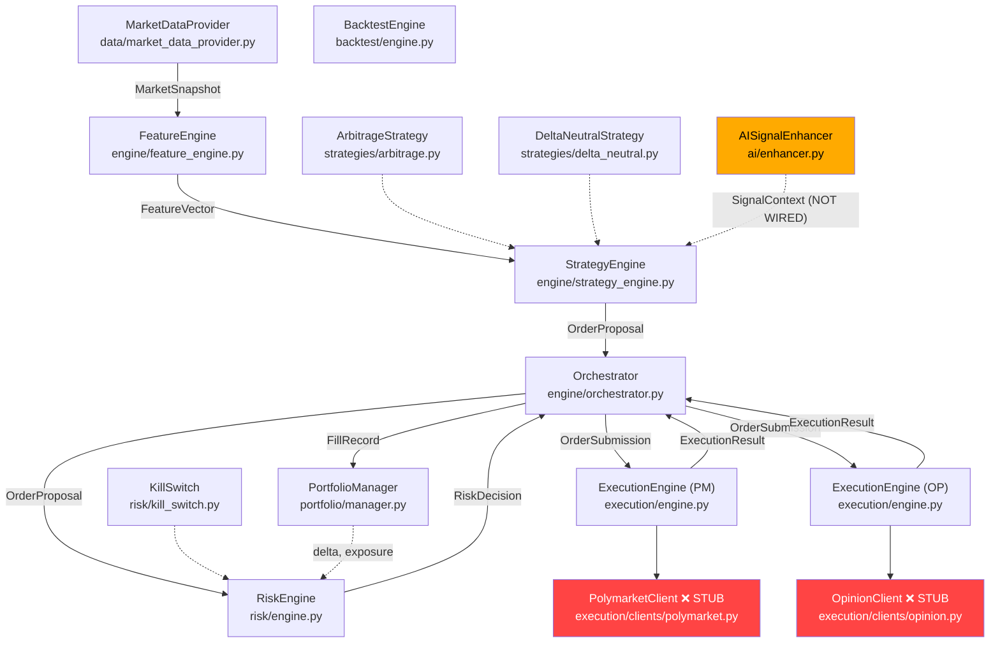

# PMTS Architectural Audit

---

## 1. SYSTEM OVERVIEW

### Actual Architecture (from code)



### Core Pipeline

The system implements a 6-stage event-driven pipeline:

| Stage | Component | Status |
|-------|-----------|--------|
| 1. DATA | `MarketDataProvider` ingests `MarketSnapshot` | ✅ Built, **no live feed** |
| 2. FEATURES | `FeatureEngine` computes `FeatureVector` | ✅ Built |
| 3. STRATEGY | `StrategyEngine` → `ArbitrageStrategy` + `DeltaNeutralStrategy` | ✅ Built |
| 4. RISK | `RiskEngine` (12-check synchronous gate) | ✅ Built |
| 5. EXECUTION | `ExecutionEngine` → `ExchangeClient` protocol | ⚠️ Engine built, **clients are stubs** |
| 6. PORTFOLIO | `PortfolioManager` records fills, tracks positions | ✅ Built |

### What Actually Works Today

- **Backtest mode**: Fully functional end-to-end via `BacktestEngine` with synthetic data, simulated latency, stochastic partial fills, and the real strategy/risk/portfolio stack.
- **Live mode**: Instantiates client skeletons, then **does nothing** — all three `ExchangeClient` methods (`place_order`, `cancel_order`, `get_order_status`) throw `NotImplementedError`.

---

## 2. STRENGTHS

### 2.1 Synchronous Risk Gate — TOCTOU Elimination
[risk/engine.py](file:///c:/Users/Honor/Desktop/polymarket-under-openclaw/polymarket-arbitrage/risk/engine.py)

The RiskEngine's `evaluate()` method is **fully synchronous** and **reserves capital before returning**. This eliminates the Time-of-Check/Time-of-Use race condition where two proposals could both pass capital checks before either reservation is recorded. This is correct and critical.

### 2.2 Clean Data Model Contracts

- `MarketSnapshot` is `frozen=True` — immutable, safe to share.
- `FeatureVector` has rigorous validation (`NaN arb_signal ↔ non-empty stale_markets` invariant).
- `OrderProposal` validates ARB-specific fields (leg_group_id, leg_number, min_fill_ratio).
- `OrderSubmission` cross-validates `token_quantity ≈ size_usdc / limit_price`.

### 2.3 Typed Exception Hierarchy

[src/errors.py](file:///c:/Users/Honor/Desktop/polymarket-under-openclaw/polymarket-arbitrage/src/errors.py) provides structured errors (`ExchangeRejected`, `CrossedBookError`, `NegativeHoldings`) with contextual metadata — essential for debugging in production.

### 2.4 Kill Switch Design

Token-gated reset prevents automated reset loops. Audit trail of all activations and resets. Synchronous activation (no I/O) — cannot be blocked by network issues.

### 2.5 Backtest Engine Realism

- Stochastic partial fills via `Beta(2.0, 1.5)` — mean ~57% fill ratio.
- Per-stage latency model (tick→signal, signal→submit, submit→fill).
- Fills against actual ask/bid prices, not mid.
- Uses the **same** strategy/risk/portfolio stack as live mode.

### 2.6 ExchangeClient Protocol

The `@runtime_checkable` protocol in [execution/engine.py](file:///c:/Users/Honor/Desktop/polymarket-under-openclaw/polymarket-arbitrage/execution/engine.py) cleanly separates the execution engine from venue-specific API details. Good separation of concerns.

### 2.7 Strategy-Level Controls

- Per-market arb cooldown prevents rapid-fire on the same opportunity.
- `arb_in_flight` flag suppresses MM quoting during active arb to avoid self-interference.
- Edge scaling: borderline arb opportunities get reduced sizing (50-100% based on edge buffer above minimum).

**Keep all of the above unchanged.**

---

## 3. CRITICAL WEAKNESSES

### 3.1 Exchange Clients Are Empty Shells

**What is wrong**: `PolymarketClient` and `OpinionClient` throw `NotImplementedError` on every method. Every method body is `raise NotImplementedError(...)`.

**Why it matters**: The system cannot place, cancel, or query a single order on any exchange. The entire execution pipeline is non-functional for live trading.

**Real-world consequence**: **Zero trading capability.** The system is a backtest-only simulator.

---

### 3.2 No WebSocket Market Data Feed

**What is wrong**: `MarketDataProvider.start()` and `stop()` are **no-ops** ([market_data_provider.py:39-43](file:///c:/Users/Honor/Desktop/polymarket-under-openclaw/polymarket-arbitrage/data/market_data_provider.py#L39-L43)). There is no WebSocket client, no REST polling loop, no subscription mechanism. The `ingest()` method exists but nothing calls it in live mode.

**Why it matters**: Without real-time data, the system has no prices to trade against. The backtest engine manually feeds snapshots via `FeatureEngine.on_snapshot()` — live mode has no equivalent.

**Real-world consequence**: The pipeline stalls at Stage 1. No data → no features → no signals → no trades.

---

### 3.3 AI Enhancer Is Not Wired Into the Pipeline

**What is wrong**: `AISignalEnhancer` exists and is fully implemented, but **it is never called by any component**. `StrategyEngine.on_feature_vector()` processes `FeatureVector` directly without consulting the AI module. `Orchestrator` does not reference `AISignalEnhancer` at all.

**Why it matters**: The `SignalContext` output (confidence multiplier, regime classification, arb quality, hedge urgency, MM suppression) was designed to modify strategy thresholds. Without it, the system operates on raw signals without any regime-awareness.

**Real-world consequence**: No impact on correctness per se, but the strategies lack the adaptive behavior that the AI module was designed to provide. The entire `ai/` package is dead code.

---

### 3.4 Both Arb Legs Submitted Simultaneously — No Conditional Leg-2

**What is wrong**: In [strategy_engine.py:169-174](file:///c:/Users/Honor/Desktop/polymarket-under-openclaw/polymarket-arbitrage/engine/strategy_engine.py#L169-L174), both `leg1_proposal` and `leg2_proposal` are emitted together and submitted concurrently. Leg-2 cancellation is attempted **retroactively** only after leg-1 reaches terminal state (in `Orchestrator._handle_arb_terminal()`).

**Why it matters**: In a real market with latency, leg-1 may fail or partially fill while leg-2 is already resting on the other exchange. The retroactive cancel may arrive too late — leg-2 may have already filled.

**Real-world consequence**: **One-legged arb exposure.** If leg-1 fills 30% but leg-2 fills 100%, you hold a large unhedged directional position. This is the single most dangerous failure mode for a cross-venue arbitrage system.

---

### 3.5 Execution Engine Poll Worker Has a Bug

**What is wrong**: In [execution/engine.py:358-359](file:///c:/Users/Honor/Desktop/polymarket-under-openclaw/polymarket-arbitrage/execution/engine.py#L358-L359), the code attempts `await asyncio.sleep(-extra)` with a negative value. `asyncio.sleep()` with negative duration raises `ValueError` in Python 3.11+.

**Why it matters**: When any order is near expiry and needs fast polling, the poll worker will crash with an unhandled exception.

**Real-world consequence**: The entire polling loop terminates. All live orders stop being monitored. Fills go unrecorded, expirations go undetected. **Silent data loss.**

---

### 3.6 No Persistence — All State Is In-Memory

**What is wrong**: `PortfolioManager`, `RiskEngine._reservations`, `OrderTracker._trackers`, `StrategyEngine._market` — all state is in-process Python dicts. Docker-compose references Redis and Postgres but the application code never connects to either.

**Why it matters**: A process restart (crash, OOM, deploy) loses:
- All position data
- All open order state
- Risk reservation table
- P&L history

**Real-world consequence**: After any restart, the system believes it has zero positions and full capital. It will **re-enter trades without knowing what it already holds**, potentially doubling positions and breaching risk limits.

---

### 3.7 Settings Mismatch — ExchangeConfig vs PolymarketConfig

**What is wrong**: `run_live()` in [main.py:158-164](file:///c:/Users/Honor/Desktop/polymarket-under-openclaw/polymarket-arbitrage/main.py#L158-L164) accesses `settings.exchange.pm_api_key`, `settings.exchange.pm_api_secret`, etc. But the `Settings` dataclass has `settings.polymarket` and `settings.opinion` — there is **no `exchange` attribute**.

**Why it matters**: `run_live()` will crash with `AttributeError: 'Settings' object has no attribute 'exchange'` on startup.

**Real-world consequence**: Live mode cannot even start. This is a first-line startup crash.

---

## 4. ARCHITECTURAL GAPS

| Component | Status | Impact |
|-----------|--------|--------|
| **WebSocket Connectivity** | MISSING | No live market data at all |
| **REST Order Execution** | STUB (NotImplementedError) | Cannot place/cancel/query orders |
| **State Persistence** | MISSING | All state lost on restart |
| **Rate Limiting** | MISSING | Risk of API ban from exchanges |
| **Reconciliation** | MISSING | No way to detect desync with exchange |
| **Observability / Metrics** | PARTIAL — counters exist but no export | Cannot monitor in production |
| **Health Check Endpoint** | MISSING — Dockerfile health check is fake | Cannot integrate with orchestration |
| **Graceful Shutdown** | PARTIAL — `stop()` methods exist but signal handling absent | Kill -9 is the only stop mechanism |
| **Configuration Validation** | PARTIAL — limits validated, credentials not | Can start with empty API keys |
| **Secret Management** | MISSING — .env file only | Credentials in plaintext on disk |
| **Position Reconciliation on Startup** | MISSING | Cannot recover from crash |
| **Market Discovery / Filtering** | MISSING | Market list is manual, no validation |

---

## 5. FAILURE MODES

### FM-1: Partial Fill on Arb Leg-1, Full Fill on Leg-2

**Current behavior**: Both legs submitted simultaneously. Leg-1 gets 30% fill, triggers cancellation of leg-2. But leg-2 already filled 100% on the other exchange. Orchestrator logs a warning. System now holds 30% YES on PM and 100% NO on OP — a large directional bet.

**Required behavior**: Leg-2 should only be submitted after leg-1 achieves minimum fill ratio. If leg-1 fails, leg-2 never enters the market.

---

### FM-2: Process Crash Mid-Trade

**Current behavior**: All in-memory state (positions, reservations, tracker status) lost. On restart, PortfolioManager starts with `initial_cash_usdc` from config. Open orders on exchanges continue to fill but fills are never recorded.

**Required behavior**: Position state persisted to disk/DB after every fill. On startup, reconcile with exchange APIs to discover current positions and open orders before accepting new signals.

---

### FM-3: WebSocket Disconnect

**Current behavior**: No WebSocket implementation exists. UNKNOWN how the system would handle this.

**Required behavior**: Automatic reconnection with exponential backoff. During disconnect: mark all snapshots as stale → FeatureEngine emits NaN arb_signal → strategies stop emitting proposals. Resume only after receiving fresh data.

---

### FM-4: Exchange API Rate Limit Hit

**Current behavior**: No rate limiting. The `ExecutionEngine` poll worker checks all live orders every 2 seconds. With many concurrent orders, this could exceed API rate limits.

**Required behavior**: Token-bucket or leaky-bucket rate limiter per exchange. Degrade gracefully — slow polling, not crash.

---

### FM-5: Stale Data Trading

**Current behavior**: `STALE_THRESHOLD_MS = 2000` in MDP. FeatureEngine marks snapshots with `received_ts - ts > 2000` as stale. This correctly blocks arb signals. However, MM quotes are **not blocked** by stale data on the specific platform (only checked in `delta_neutral.py` `evaluate_mm()` for the quoting platform, not the counterpart).

**Required behavior**: MM quotes should also be suppressed when the **counterpart** venue's data is stale, because the Stoikov reservation price depends on the mid price which is only from the local venue — if the other venue has moved, the MM's fair value is wrong.

---

### FM-6: Order Fill Desync

**Current behavior**: Fill tracking relies entirely on polling `get_order_status()`. If a poll response is lost or the order fills between polls, the tracker's `cumulative_filled_usdc` lags reality.

**Required behavior**: WebSocket fill stream for real-time fill notification. Poll as backup, not primary.

---

### FM-7: Duplicate Orders After Kill Switch Reset

**Current behavior**: After kill switch reset, the `StrategyEngine._market` per-market state still has `arb_in_flight = True` for any arb that was cancelled during the kill switch response. The `_arb_groups` in Orchestrator may still have stale entries. New opportunities are suppressed.

**Required behavior**: Kill switch reset should flush per-market state, clear arb groups, and reset strategy cooldown timers.

---

### FM-8: `asyncio.sleep(-extra)` Crash in Poll Worker

**Current behavior**: The poll worker in [execution/engine.py:359](file:///c:/Users/Honor/Desktop/polymarket-under-openclaw/polymarket-arbitrage/execution/engine.py#L359) calls `await asyncio.sleep(-extra)` where `extra = poll_normal_s - poll_fast_s`. When `poll_normal_s=2.0` and `poll_fast_s=0.5`, `extra=1.5` and sleep is called with `-1.5`. Python 3.11+ raises `ValueError`.

**Required behavior**: The intent is "we already slept too long, poll immediately." Replace with `continue` or `asyncio.sleep(0)`.

---

### FM-9: Backtest Arb Leg Coordination Is Weaker Than Live

**Current behavior**: In backtest, `_handle_fill()` calls `notify_arb_terminal` on each individual fill event. But it never calls `notify_arb_cleared()` because the Orchestrator (which manages `_arb_groups`) is not used in backtest mode. This means `arb_in_flight` is never cleared per-market, causing MM suppression for the remainder of the backtest.

**Required behavior**: Backtest should track arb groups and clear them, or use the Orchestrator directly.

---

### FM-10: PortfolioManager MTM Price Source Stale Check

**Current behavior**: `get_portfolio_mtm()` and `get_market_exposure_usdc()` call `price_source()` which returns whatever was last stored. There is no staleness check on the price used for MTM calculation.

**Required behavior**: MTM calculation should flag or penalize positions where the price source hasn't been updated recently. Risk decisions based on stale MTM could approve orders that should be rejected.

---

### FM-11: Tracker Leak in ExecutionEngine

**Current behavior**: `_trackers` dict is never pruned. Every order ever submitted remains in memory forever. For a system running 24/7, this is an unbounded memory leak.

**Required behavior**: Terminal trackers should be pruned after a retention period (e.g., 5 minutes post-terminal for debugging, then evicted).

---

### FM-12: No Market-Open/Close Awareness

**Current behavior**: The system has no concept of market resolution. `days_to_resolution` is passed through as a feature but the system will continue attempting to trade a market that has resolved.

**Required behavior**: Auto-remove resolved markets. Trigger redemption flow when a market resolves.

---

## 6. PRIORITIZED ROADMAP

> [!IMPORTANT]
> This is a strict priority order. Each step must be substantially complete before the next begins. Dependency violations will cause cascading integration failures.

### Step 1: Fix Startup Crash + Poll Worker Bug

- Fix the `settings.exchange` AttributeError in `main.py` (use `settings.polymarket` / `settings.opinion`)
- Fix `asyncio.sleep(-extra)` in `execution/engine.py:359`
- Add tracker pruning in ExecutionEngine to prevent memory leak

**Impact**: System can start and not crash. Prerequisite for everything else.

---

### Step 2: Implement Exchange Clients (Polymarket + Opinion)

- Implement `PolymarketClient.place_order()`, `cancel_order()`, `get_order_status()` using Polymarket CLOB API
- Implement `OpinionClient` equivalents using Opinion Markets API
- Include authentication, request signing, error mapping to `ExchangeRejected`
- Add per-client rate limiters (token bucket)

**Impact**: Execution pipeline becomes functional. Orders can be placed on real exchanges.

---

### Step 3: Implement WebSocket Market Data Feed

- Build WebSocket adapter for Polymarket and Opinion that produces `MarketSnapshot` objects
- Wire into `MarketDataProvider.ingest()`
- Handle reconnection, staleness marking, heartbeat monitoring
- Implement `MarketDataProvider.start()` / `stop()` for real

**Impact**: System receives live data. The full pipeline can run end-to-end.

---

### Step 4: Sequential Arb Leg Execution

- Refactor arb submission: leg-1 submits immediately, leg-2 held until leg-1 fill confirmation
- If leg-1 fill_ratio ≥ min_fill_ratio, submit leg-2 with size proportional to actual fill
- If leg-1 fails or underfills, abandon leg-2 (no exchange interaction needed)
- Update Orchestrator `_route_to_engine` and `_handle_arb_terminal` accordingly

**Impact**: Eliminates one-legged arb risk — the single most dangerous failure mode.

---

### Step 5: State Persistence + Crash Recovery

- Persist position state (PortfolioManager) to SQLite or Postgres after each fill
- On startup: load position state, reconcile with exchange APIs (query open orders, balances)
- Persist risk reservation table for crash recovery
- WAL-mode SQLite is sufficient for single-process deployment

**Impact**: System survives restarts without state loss.

---

### Step 6: Observability + Health Monitoring

- Export metrics counters (already tracked as instance vars) to Prometheus or a log-structured format
- Add `/health` HTTP endpoint (replace the fake Dockerfile healthcheck)
- Structured alerting on kill switch activation, drawdown warning, consecutive API errors
- Add SIGTERM/SIGINT handler for graceful shutdown (cancel all orders, persist state, then exit)

**Impact**: Operator can monitor system in production and respond to incidents.

---

### Step 7: Wire AI Enhancer + End-to-End Integration Test

- Wire `AISignalEnhancer` into `StrategyEngine.on_feature_vector()` — call `enhance(fv)` and use the returned `SignalContext` to modulate thresholds
- Add integration test: feed recorded market data through the live pipeline (with a mock exchange client), verify fills, portfolio state, risk limits
- Run on testnet/paper-trade for 48+ hours before live capital

**Impact**: Full feature utilization. Validated end-to-end behavior before going live.

---

## 7. DESIGN IMPROVEMENTS

### 7.1 Arb Leg Coordinator (New Module)

**Current**: Arb leg coordination is split between `StrategyEngine` (emits both proposals) and `Orchestrator._handle_arb_terminal()` (retroactive cancel).

**Proposed**: Extract an `ArbLegCoordinator` that owns the leg-1-then-leg-2 state machine:
- Receives arb evaluation from StrategyEngine
- Submits leg-1 only
- On leg-1 fill confirmation → computes leg-2 size proportional to actual fill → submits leg-2
- On leg-1 failure → clears arb_in_flight, no leg-2

This decouples the coordination logic from both the strategy and the orchestrator.

---

### 7.2 MarketDataProvider → Exchange Adapter Boundary

**Current**: `MarketDataProvider` is a passive bus — it receives snapshots but doesn't know where they come from.

**Proposed**: Define an `ExchangeAdapter` interface:
```
protocol ExchangeAdapter:
    platform: Platform
    async start() → None
    async stop() → None
    set_snapshot_callback(cb) → None
```

Each venue implements this. `MarketDataProvider` holds adapters and manages their lifecycle. This is where WebSocket reconnection, staleness detection, and health checking live.

---

### 7.3 Separate Execution Flow for Hedges vs Arb

**Current**: All orders go through the same `ExecutionEngine` → `ExchangeClient` path with priority differentiation only in the queue.

**Proposed**: Hedges and arb have fundamentally different urgency profiles:
- **Arb**: Time-critical, 2-second expiry, must cross spread aggressively
- **Hedge**: Can post limit orders, 30-second expiry, doesn't need to cross

Encode this at the execution level: arb orders use IOC (immediate-or-cancel) if the exchange supports it. Hedge/MM orders use GTC with expiry. This is a behavior difference, not just a priority difference.

---

### 7.4 Position Store as First-Class Interface

**Current**: `PortfolioManager` mixes position tracking, capital management, MTM calculation, and snapshot publishing.

**Proposed**: Split into:
- `PositionStore`: owns position state, `apply_fill()`, `get_delta()` — minimal, easily persisted
- `PortfolioCalculator`: MTM, exposure, drawdown — stateless functions over PositionStore + price source
- `PortfolioManager`: lifecycle, capital reservation, snapshot loop — orchestration over the above

This makes persistence (Step 5) straightforward: only `PositionStore` needs to be serialized.

---

### 7.5 Unified Clock

**Current**: `_now_ms()` is defined in **9 separate files**. Each module independently calls `time.time() * 1000`. In backtest mode, the BacktestEngine passes `now_ts` as a parameter through `on_feature_vector()` — but other components still use wall-clock time (e.g., `OrderTracker`, `RiskEngine._dedup`).

**Proposed**: Define a `Clock` protocol:
- `LiveClock`: returns `time.time() * 1000`
- `SimClock`: returns the current simulated timestamp

Pass the clock instance to all components that need timestamps. Eliminates the time skew between backtest-mode components that use simulated time and those that use wall-clock time.

---

## 8. SIMPLICITY CHECK

| Proposal | Necessary? | Can it be simplified? |
|----------|-----------|----------------------|
| **Fix bugs (Step 1)** | ✅ Must-do | Already minimal |
| **Exchange clients (Step 2)** | ✅ Must-do | Implement Polymarket first (it's the primary venue). Opinion can follow. |
| **WebSocket feed (Step 3)** | ✅ Must-do | Start with REST polling at 500ms intervals as MVP. WebSocket is the target but REST polling gets you running sooner. |
| **Sequential arb legs (Step 4)** | ✅ Must-do | Could be simplified: instead of a full coordinator module, add a callback on leg-1 terminal that conditionally submits leg-2 within the existing Orchestrator. The state machine is only 3 states. |
| **Persistence (Step 5)** | ✅ Must-do for real money | SQLite WAL mode. Don't build a migration framework — one table for positions, one for fills. `json` column for complex fields. |
| **Observability (Step 6)** | ⚠️ Important but not blocking | Start with structured JSON logs (already implemented). Prometheus/Grafana can wait. A `/health` endpoint is a 20-line HTTP server — do it. |
| **AI integration (Step 7)** | ⚠️ Nice-to-have | The heuristic fallback already produces useful `SignalContext`. Wiring it in is ~30 lines of code. The Claude API call is the risky part — keep `use_heuristic_only=True` for initial live deployment. |
| **ArbLegCoordinator (7.1)** | ⚠️ Can simplify | Keep it inside Orchestrator. Don't extract a new module unless the Orchestrator exceeds 500 lines. |
| **ExchangeAdapter (7.2)** | ✅ Needed | But don't over-abstract. One class per venue that owns both WebSocket and REST is fine. |
| **Position Store split (7.4)** | ⚠️ Can defer | Only needed when persistence is added. Split at that point, not before. |
| **Unified Clock (7.5)** | ✅ Worth doing early | Low effort, high value for backtest correctness. ~20 lines of code. |

---

> [!CAUTION]
> **The system cannot trade real money in its current state.** Exchange clients are stubs, live data feeds don't exist, state is ephemeral, and arb leg coordination has a dangerous race condition. The backtest engine is solid and the internal architecture is well-designed, but the boundary between "backtest simulator" and "live trading system" has not been crossed.
